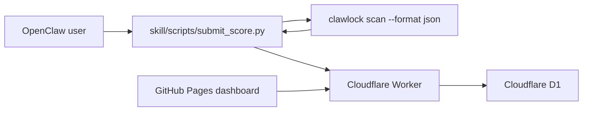

# ClawLockRank

[中文说明](./README.zh-CN.md)

ClawLockRank is a leaderboard project built from ClawLock inspection results. This repository contains the GitHub Pages dashboard, the Cloudflare Worker + D1 backend, and the local upload skill used after a user finishes a local ClawLock inspection.

## Architecture



## Repo layout

```text
.
|- index.html
|- app.js
|- styles.css
|- config.js
|- assets/
|- skill/
|  |- SKILL.md
|  |- SKILL_EN.md
|  |- config.json
|  `- scripts/
|     |- run_scan.py
|     |- upload.py
|     `- submit_score.py
`- worker/
   |- schema.sql
   |- wrangler.toml
   `- src/index.ts
```

## Frontend

The static dashboard calls `GET /api/scores`.
This repository also includes a GitHub Pages workflow at `.github/workflows/deploy-pages.yml`.

Before publishing, edit [config.js](./config.js):

```js
window.CLAWLOCK_RANK_CONFIG = {
  apiBase: "https://your-worker-domain.workers.dev",
  enableSSE: false
};
```

## Worker setup

1. Install dependencies:

```bash
cd worker
npm install
```

2. Create a D1 database.
3. Copy `.dev.vars.example` to `.dev.vars` if you want to use `wrangler dev`.
4. Apply [worker/schema.sql](./worker/schema.sql).
5. Update [worker/wrangler.toml](./worker/wrangler.toml):
   - set `database_id`
   - set `PUBLIC_ORIGIN`
   - tune the anti-abuse defaults if needed:
     - `SUBMIT_COOLDOWN_HOURS`
     - `TIMESTAMP_MAX_AGE_MINUTES`
     - `TIMESTAMP_MAX_FUTURE_MINUTES`
     - `IP_RATE_LIMIT_WINDOW_MINUTES`
     - `IP_RATE_LIMIT_MAX_SUBMISSIONS`
6. Set a real salt:

```bash
cd worker
wrangler secret put DEVICE_HASH_SALT
```

7. Initialize the database and deploy:

```bash
cd worker
wrangler d1 execute clawlock-rank --file=./schema.sql
wrangler deploy
```

## Skill usage

The skill targets `clawlock>=2.2.1` and uses `clawlock scan --format json` as the only source of truth for upload payloads.

Expected user flow:

1. install or import the skill
2. ask to upload a security score or submit an inspection result
3. choose a public nickname
4. review the upload preview
5. confirm or cancel

Suggested trigger phrases:

- `upload security score`
- `submit leaderboard score`
- `upload inspection result`
- `sync score to ClawLockRank`

Default one-shot entrypoint:

```bash
python skill/scripts/submit_score.py
```

This command:

- runs `clawlock scan --format json` locally
- requires `clawlock>=2.2.1`
- keeps only the fields the leaderboard needs
- shows a preview before upload
- uploads only after explicit confirmation
- reads the default Worker origin from `skill/config.json`

Recommended Claw / ClawHub flow:

```bash
python skill/scripts/submit_score.py --preview-only
python skill/scripts/upload.py --input <payload_path> --nickname "<nickname>" --yes
```

The preview step returns structured JSON, including a reusable `payload_path`. The assistant should ask for the nickname and confirmation in conversation before calling `upload.py`.

You can also override the Worker origin with `CLAWLOCK_RANK_API_BASE`.

## Worker API

### `POST /api/submit`

Accepts:

```json
{
  "submission": {
    "tool": "ClawLock",
    "clawlock_version": "2.2.1",
    "adapter": "OpenClaw",
    "adapter_version": "1.1.9",
    "device_fingerprint": "device-fingerprint-from-scan",
    "evidence_hash": "sha256-of-the-canonical-local-scan-report",
    "score": 95,
    "grade": "A",
    "nickname": "MiSec-Lab",
    "findings": [
      {
        "scanner": "config",
        "level": "critical",
        "title": "Gateway auth disabled"
      }
    ],
    "timestamp": "2026-04-03T12:00:00Z"
  },
  "meta": {
    "source": "clawlock-rank-skill",
    "skill_version": "1.1.0"
  }
}
```

### `GET /api/scores`

Returns:

```json
{
  "leaderboard": [],
  "top_vulnerabilities": [],
  "stats": {
    "top_vulnerabilities": []
  }
}
```

## Data handling

Only these fields are allowed to leave the device:

- `tool`
- `clawlock_version`
- `adapter`
- `adapter_version`
- `device_fingerprint`
- `evidence_hash`
- `score`
- `grade`
- `nickname`
- `findings[].scanner`
- `findings[].level`
- `findings[].title`
- `timestamp`

Never uploaded:

- raw config files
- remediation text
- local file paths / `location`
- environment variables
- `~/.clawlock/scan_history.json`
- the full raw scan report

Additional backend protections:

- per-device cooldown
- timestamp freshness checks
- IP-based rate limiting
- leaderboard and vulnerability hotspot aggregation based on the latest valid result per device
