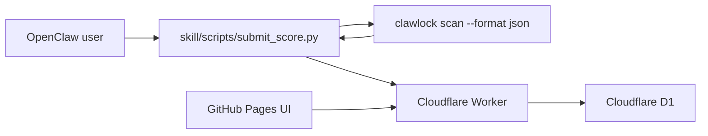

# ClawLockRank

[中文说明](./README.zh-CN.md)

ClawLockRank is a leaderboard project built from ClawLock inspection results, with a GitHub Pages frontend, a lightweight Cloudflare Worker backend, and a local upload skill.

## Architecture



## Repo layout

```text
.
|- index.html
|- app.js
|- styles.css
|- config.js
|- assets/
|- skill/
|  |- SKILL.md
|  |- SKILL_EN.md
|  |- config.json
|  `- scripts/
|     |- run_scan.py
|     |- upload.py
|     `- submit_score.py
`- worker/
   |- schema.sql
   |- wrangler.toml
   `- src/index.ts
```

## Frontend

The static dashboard is wired to call `GET /api/scores`.
This repository also includes a GitHub Pages workflow at `.github/workflows/deploy-pages.yml`.

Edit [config.js](./config.js) before publishing:

```js
window.CLAWLOCK_RANK_CONFIG = {
  apiBase: "https://your-worker-domain.workers.dev",
  enableSSE: false
};
```

## Worker setup

1. Install Worker dependencies:

```bash
cd worker
npm install
```

2. Create a D1 database.
3. Copy `.dev.vars.example` to `.dev.vars` if you want to use `wrangler dev`.
4. Apply `worker/schema.sql`.
5. Update `worker/wrangler.toml`:
   - set `database_id`
   - set `PUBLIC_ORIGIN` to your site origin
6. Set a real salt:

```bash
cd worker
wrangler secret put DEVICE_HASH_SALT
```

7. Deploy:

```bash
cd worker
wrangler d1 execute clawlock-rank --file=./schema.sql
wrangler deploy
```

## User flow

For regular users, the intended experience is:

1. import the skill
2. ask the assistant to upload a security score or submit an inspection result
3. review the public upload preview
4. confirm or cancel

Suggested trigger phrases:

- `upload security score`
- `submit leaderboard score`
- `upload inspection result`
- `sync score to ClawLockRank`

The default one-shot entrypoint is:

```bash
python skill/scripts/submit_score.py
```

This command:

- runs the scan locally
- strips the payload down to the fields the leaderboard actually needs
- shows the user a preview of the public upload data
- uploads only after explicit confirmation
- reads the default Worker origin from `skill/config.json`

Advanced two-step workflow:

```bash
python skill/scripts/run_scan.py --adapter openclaw --output ./clawlock-rank-payload.json
python skill/scripts/upload.py --input ./clawlock-rank-payload.json
```

You can also set `CLAWLOCK_RANK_API_BASE` to override the default Worker origin.

## Worker API

### `POST /api/submit`

Accepts:

```json
{
  "submission": {
    "tool": "ClawLock",
    "clawlock_version": "1.3.0",
    "adapter": "OpenClaw",
    "adapter_version": "1.1.9",
    "device_fingerprint": "device-fingerprint-from-scan",
    "score": 95,
    "grade": "A",
    "nickname": "MiSec-Lab",
    "findings": [
      {
        "scanner": "config",
        "level": "critical",
        "title": "Gateway auth disabled"
      }
    ],
    "timestamp": "2026-04-03T12:00:00Z"
  },
  "meta": {
    "source": "clawlock-rank-skill",
    "skill_version": "0.1.0"
  }
}
```

### `GET /api/scores`

Returns:

```json
{
  "leaderboard": [],
  "top_vulnerabilities": [],
  "stats": {
    "top_vulnerabilities": []
  }
}
```

## Data handling

- The client sends the raw device fingerprint only to the Worker.
- The Worker hashes the fingerprint with a server salt before storage.
- The upload scripts whitelist only the fields needed for ranking and vulnerability aggregation.
- The frontend only displays the nickname, derived avatar seed, score, and aggregated vulnerability stats.
- Raw configs, remediation text, file paths, environment variables, and the full raw report are not uploaded.
- `scan_history.json` is intentionally not used because it does not preserve the full findings list.
