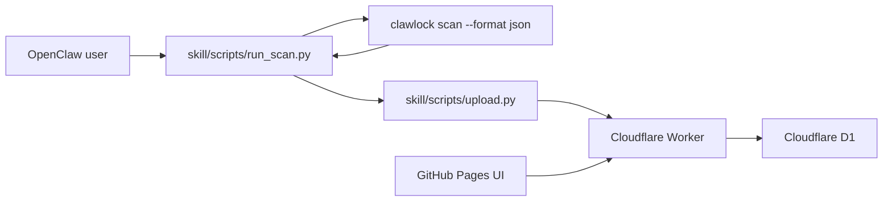

# ClawLockRank

ClawLockRank is a GitHub Pages leaderboard for ClawLock / OpenClaw security benchmark results, plus a lightweight Cloudflare Worker backend that accepts user submissions and aggregates vulnerability hotspots.

## Architecture



## Repo layout

```text
.
|- index.html
|- app.js
|- styles.css
|- config.js
|- assets/
|- skill/
|  |- SKILL.md
|  `- scripts/
|     |- run_scan.py
|     `- upload.py
`- worker/
   |- schema.sql
   |- wrangler.toml
   `- src/index.ts
```

## Frontend

The static dashboard is already wired to call `GET /api/scores`.
This repository also includes a GitHub Pages workflow at `.github/workflows/deploy-pages.yml`.

Edit `config.js` before publishing:

```js
window.CLAWLOCK_RANK_CONFIG = {
  apiBase: "https://your-worker-domain.workers.dev",
  enableSSE: false
};
```

Notes:

- `enableSSE` is off by default because the starter Worker only supports polling.
- The page already polls every 10 seconds.
- The Pages workflow publishes only the static frontend files and `assets/`.

## Worker setup

1. Install Worker dependencies:

```bash
cd worker
npm install
```

2. Create a D1 database.
3. Copy `.dev.vars.example` to `.dev.vars` if you want to use `wrangler dev`.
4. Apply `worker/schema.sql`.
5. Update `worker/wrangler.toml`:
   - set `database_id`
   - set `PUBLIC_ORIGIN` to your site origin, for example `https://g1at.github.io`
6. Set a real salt:

```bash
cd worker
wrangler secret put DEVICE_HASH_SALT
```

7. Deploy:

```bash
cd worker
wrangler d1 execute clawlock-rank --file=./schema.sql
wrangler deploy
```

If `wrangler deploy` asks for a `workers.dev` subdomain, complete the onboarding in the Cloudflare dashboard first, then rerun the deploy command.

## Local Worker development

```bash
cd worker
npm run dev
```

## Worker API

### `POST /api/submit`

Accepts:

```json
{
  "submission": {
    "tool": "ClawLock",
    "clawlock_version": "1.3.0",
    "adapter": "OpenClaw",
    "adapter_version": "1.1.9",
    "platform": "linux-x86_64",
    "device_fingerprint": "device-fingerprint-from-scan",
    "score": 95,
    "grade": "A",
    "nickname": "MiSec-Lab",
    "domain_scores": {},
    "domain_grades": {},
    "findings": [
      {
        "scanner": "config",
        "level": "critical",
        "title": "Gateway auth disabled",
        "location": "config:gatewayAuth"
      }
    ],
    "timestamp": "2026-04-03T12:00:00Z",
    "evidence_hash": "sha256..."
  },
  "meta": {
    "source": "clawlock-rank-skill",
    "skill_version": "0.1.0"
  }
}
```

Returns the accepted score plus the current rank for the device.

### `GET /api/scores`

Returns:

```json
{
  "leaderboard": [],
  "top_vulnerabilities": [],
  "stats": {
    "top_vulnerabilities": []
  }
}
```

Aggregation rules:

- leaderboard keeps the latest valid submission per device
- ranking sorts by `score desc`, then newest submission
- Top 5 vulnerabilities count unique devices from their latest submission

## Skill usage

This project does not depend on `~/.clawlock/scan_history.json`.

Generate a normalized payload:

```bash
python skill/scripts/run_scan.py --adapter openclaw --output ./clawlock-rank-payload.json
```

Upload it:

```bash
python skill/scripts/upload.py --input ./clawlock-rank-payload.json --api-base https://your-worker-domain.workers.dev --nickname "Alice" --yes
```

The upload script also supports:

- `CLAWLOCK_RANK_API_BASE`
- interactive confirmation when `--yes` is omitted

## Data handling

- The client sends the raw device fingerprint only to the Worker.
- The Worker hashes the fingerprint with a server salt before storage.
- The frontend only displays the nickname, derived avatar seed, score, and aggregated vulnerability stats.
- `scan_history.json` is intentionally not used because it does not preserve the full findings list.
