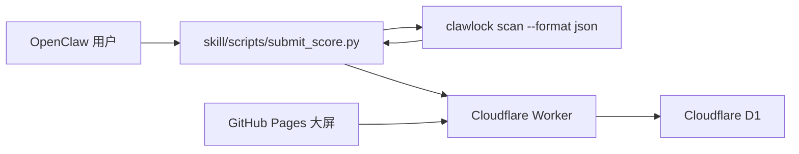

# ClawLockRank 中文说明

[English README](./README.md)

ClawLockRank 是一个基于 ClawLock 体检结果构建的排行榜项目。这个仓库同时包含 GitHub Pages 大屏前端、Cloudflare Worker + D1 后端，以及用户在本地完成体检后自愿上传成绩的 skill。

## 架构



## 仓库结构

```text
.
|- index.html
|- app.js
|- styles.css
|- config.js
|- assets/
|- skill/
|  |- SKILL.md
|  |- SKILL_EN.md
|  |- config.json
|  `- scripts/
|     |- run_scan.py
|     |- upload.py
|     `- submit_score.py
`- worker/
   |- schema.sql
   |- wrangler.toml
   `- src/index.ts
```

## 前端

静态大屏通过 `GET /api/scores` 获取排行榜数据，仓库中也已经包含 GitHub Pages 工作流 `.github/workflows/deploy-pages.yml`。

发布前请修改 [config.js](./config.js)：

```js
window.CLAWLOCK_RANK_CONFIG = {
  apiBase: "https://your-worker-domain.workers.dev",
  enableSSE: false
};
```

## Worker 部署

1. 安装依赖：

```bash
cd worker
npm install
```

2. 创建 D1 数据库。
3. 如果要使用本地 `wrangler dev`，把 `.dev.vars.example` 复制成 `.dev.vars`。
4. 执行 [worker/schema.sql](./worker/schema.sql)。
5. 修改 [worker/wrangler.toml](./worker/wrangler.toml)：
   - 设置 `database_id`
   - 设置 `PUBLIC_ORIGIN`
   - 如有需要，调整防刷参数：
     - `SUBMIT_COOLDOWN_HOURS`
     - `TIMESTAMP_MAX_AGE_MINUTES`
     - `TIMESTAMP_MAX_FUTURE_MINUTES`
     - `IP_RATE_LIMIT_WINDOW_MINUTES`
     - `IP_RATE_LIMIT_MAX_SUBMISSIONS`
6. 设置真实 salt：

```bash
cd worker
wrangler secret put DEVICE_HASH_SALT
```

7. 初始化数据库并部署：

```bash
cd worker
wrangler d1 execute clawlock-rank --file=./schema.sql
wrangler deploy
```

## Skill 使用方式

当前 skill 面向 `clawlock>=2.2.1`，并且只以 `clawlock scan --format json` 作为上传数据的唯一事实来源。

推荐用户流程：

1. 导入或安装 skill
2. 在对话中表达“上传安全分”“提交排行榜结果”之类的意图
3. 输入想公开展示的昵称
4. 查看上传预览
5. 确认或取消

推荐触发词：

- `上传安全分`
- `上传安全体检分数`
- `上传排行榜`
- `提交体检成绩`
- `同步分数到 ClawLockRank`

默认一键入口：

```bash
python skill/scripts/submit_score.py
```

这个脚本会：

- 本地执行 `clawlock scan --format json`
- 要求 `clawlock>=2.2.1`
- 只保留排行榜真正需要的字段
- 先展示上传预览，再等待确认
- 只有在明确同意后才上传
- 默认读取 `skill/config.json` 里的 Worker 地址

对于 Claw / ClawHub 集成，更推荐使用两步式流程：

```bash
python skill/scripts/submit_score.py --preview-only
python skill/scripts/upload.py --input <payload_path> --nickname "<nickname>" --yes
```

预览命令会返回结构化 JSON，其中的 `payload_path` 应在确认上传阶段复用。模型应先在对话里问昵称、展示预览、拿到明确确认，再调用 `upload.py`。

如果需要，也可以通过 `CLAWLOCK_RANK_API_BASE` 覆盖默认 Worker 地址。

## Worker API

### `POST /api/submit`

接收：

```json
{
  "submission": {
    "tool": "ClawLock",
    "clawlock_version": "2.2.1",
    "adapter": "OpenClaw",
    "adapter_version": "1.1.9",
    "device_fingerprint": "device-fingerprint-from-scan",
    "evidence_hash": "sha256-of-the-canonical-local-scan-report",
    "score": 95,
    "grade": "A",
    "nickname": "MiSec-Lab",
    "findings": [
      {
        "scanner": "config",
        "level": "critical",
        "title": "Gateway auth disabled"
      }
    ],
    "timestamp": "2026-04-03T12:00:00Z"
  },
  "meta": {
    "source": "clawlock-rank-skill",
    "skill_version": "1.0.0"
  }
}
```

### `GET /api/scores`

返回：

```json
{
  "leaderboard": [],
  "top_vulnerabilities": [],
  "stats": {
    "top_vulnerabilities": []
  }
}
```

## 隐私与最小化上传

当前只允许这些字段离开本地设备：

- `tool`
- `clawlock_version`
- `adapter`
- `adapter_version`
- `device_fingerprint`
- `evidence_hash`
- `score`
- `grade`
- `nickname`
- `findings[].scanner`
- `findings[].level`
- `findings[].title`
- `timestamp`

明确不会上传：

- 原始配置文件
- remediation / 修复建议文本
- 本地文件路径或 `location`
- 环境变量
- `~/.clawlock/scan_history.json`
- 完整原始扫描报告

后端还会额外执行：

- 按设备冷却
- 时间戳新鲜度校验
- IP 频率限制
- 榜单和安全漏洞热点只按设备最新一条有效结果统计
