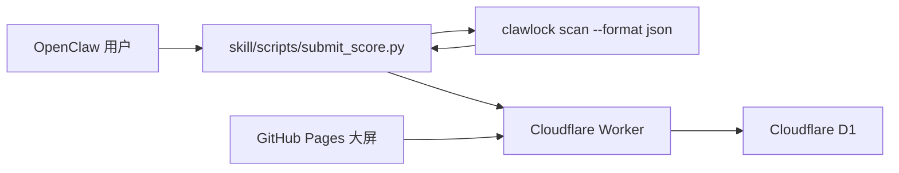

# ClawLockRank 中文说明

[English README](./README.md)

ClawLockRank 是一个基于 ClawLock 体检结果构建的排行榜项目，仓库同时包含：

- GitHub Pages 大屏前端
- Cloudflare Worker + D1 后端
- 用于本地扫描并自愿上传成绩的 skill 脚本

## 架构



## 仓库结构

```text
.
|- index.html
|- app.js
|- styles.css
|- config.js
|- assets/
|- skill/
|  |- SKILL.md
|  |- SKILL_EN.md
|  |- config.json
|  `- scripts/
|     |- run_scan.py
|     |- upload.py
|     `- submit_score.py
`- worker/
   |- schema.sql
   |- wrangler.toml
   `- src/index.ts
```

## 前端

静态页面请求 `GET /api/scores` 获取排行榜数据。仓库内已包含 GitHub Pages 工作流 `.github/workflows/deploy-pages.yml`。

发布前请修改 [config.js](./config.js)：

```js
window.CLAWLOCK_RANK_CONFIG = {
  apiBase: "https://your-worker-domain.workers.dev",
  enableSSE: false
};
```

## Worker 部署

1. 安装依赖

```bash
cd worker
npm install
```

2. 创建 D1 数据库
3. 如需本地 `wrangler dev`，复制 `.dev.vars.example` 为 `.dev.vars`
4. 执行 [worker/schema.sql](./worker/schema.sql)
5. 更新 [worker/wrangler.toml](./worker/wrangler.toml)
   - 设置 `database_id`
   - 设置 `PUBLIC_ORIGIN`
   - 如有需要，调整防刷参数：
     - `SUBMIT_COOLDOWN_HOURS`
     - `TIMESTAMP_MAX_AGE_MINUTES`
     - `TIMESTAMP_MAX_FUTURE_MINUTES`
     - `IP_RATE_LIMIT_WINDOW_MINUTES`
     - `IP_RATE_LIMIT_MAX_SUBMISSIONS`
6. 设置真实 salt

```bash
cd worker
wrangler secret put DEVICE_HASH_SALT
```

7. 初始化数据库并部署

```bash
cd worker
wrangler d1 execute clawlock-rank --file=./schema.sql
wrangler deploy
```

## 用户使用方式

对普通用户来说，目标体验是：

1. 导入 skill
2. 在对话中表达“上传安全分”“上传体检成绩”“提交排行榜结果”这类意图
3. 输入想公开展示的昵称
4. 查看上传预览
5. 确认或取消

推荐触发词：

- `上传安全分`
- `上传安全体检分数`
- `上传排行榜`
- `提交体检成绩`
- `同步分数到 ClawLockRank`

默认一键入口：

```bash
python skill/scripts/submit_score.py
```

这个脚本会：

1. 本地执行 `clawlock scan --format json`
2. 仅保留排行榜真正需要的字段
3. 展示将要公开上传的数据预览
4. 只有在明确确认后才上传
5. 默认读取 `skill/config.json` 中配置的 Worker 地址

高级两步模式：

```bash
python skill/scripts/run_scan.py --adapter openclaw --output ./clawlock-rank-payload.json
python skill/scripts/upload.py --input ./clawlock-rank-payload.json
```

也可以通过 `CLAWLOCK_RANK_API_BASE` 覆盖默认 Worker 地址。

对于 Claw / ClawHub 集成，推荐使用更适合模型调用的两步方式：

```bash
python skill/scripts/submit_score.py --preview-only
python skill/scripts/upload.py --input <payload_path> --nickname "<nickname>" --yes
```

预览命令会返回结构化 JSON，其中的 `payload_path` 应被后续确认上传阶段复用。

## Worker API

### `POST /api/submit`

接收精简后的 payload：

```json
{
  "submission": {
    "tool": "ClawLock",
    "clawlock_version": "1.3.0",
    "adapter": "OpenClaw",
    "adapter_version": "1.1.9",
    "device_fingerprint": "device-fingerprint-from-scan",
    "evidence_hash": "sha256-of-the-canonical-local-scan-report",
    "score": 95,
    "grade": "A",
    "nickname": "MiSec-Lab",
    "findings": [
      {
        "scanner": "config",
        "level": "critical",
        "title": "Gateway auth disabled"
      }
    ],
    "timestamp": "2026-04-03T12:00:00Z"
  },
  "meta": {
    "source": "clawlock-rank-skill",
    "skill_version": "1.0.0"
  }
}
```

### `GET /api/scores`

返回：

```json
{
  "leaderboard": [],
  "top_vulnerabilities": [],
  "stats": {
    "top_vulnerabilities": []
  }
}
```

## 隐私与最小化上传

当前脚本与 Worker 只允许上传以下字段：

- `tool`
- `clawlock_version`
- `adapter`
- `adapter_version`
- `device_fingerprint`
- `evidence_hash`
- `score`
- `grade`
- `nickname`
- `findings[].scanner`
- `findings[].level`
- `findings[].title`
- `timestamp`

明确不会上传：

- 原始配置文件
- 修复建议 / remediation 文本
- 本地文件路径 / `location`
- 环境变量
- `~/.clawlock/scan_history.json`
- 完整原始扫描报告

设备指纹说明：

- 客户端只会把原始 `device_fingerprint` 发给 Worker
- Worker 会在服务端使用 salt 哈希后再入库
- 前端不会公开展示原始设备指纹

## 防刷与可信度

当前后端会执行以下限制：

- 同一设备默认 `24` 小时冷却
- 只接受最近一段时间内生成的扫描结果
- 同一 IP 有单独的频率限制
- 排行榜与漏洞热点都按设备最新一次有效结果计算
- skill 会基于本地扫描报告生成 `evidence_hash`，但不会上传完整报告
