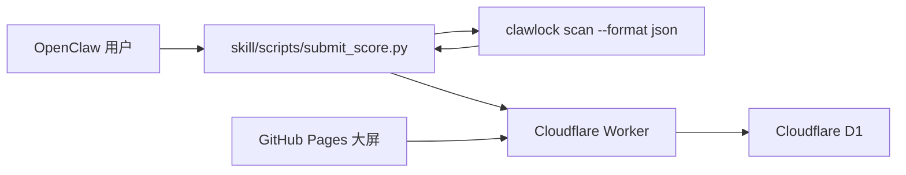

# ClawLockRank 中文说明

[English README](./README.md)

ClawLockRank 是一个基于 ClawLock 体检结果构建的排行榜项目。仓库同时包含：

- GitHub Pages 大屏前端
- Cloudflare Worker + D1 后端
- 用于本地扫描并自愿上传分数的 skill 脚本

## 架构



## 仓库结构

```text
.
|- index.html
|- app.js
|- styles.css
|- config.js
|- assets/
|- skill/
|  |- SKILL.md
|  |- SKILL_EN.md
|  |- config.json
|  `- scripts/
|     |- run_scan.py
|     |- upload.py
|     `- submit_score.py
`- worker/
   |- schema.sql
   |- wrangler.toml
   `- src/index.ts
```

## 前端

静态页面会请求 `GET /api/scores`。  
发布前请修改 [config.js](./config.js)：

```js
window.CLAWLOCK_RANK_CONFIG = {
  apiBase: "https://your-worker-domain.workers.dev",
  enableSSE: false
};
```

## Worker 部署

1. 安装依赖：

```bash
cd worker
npm install
```

2. 创建 D1 数据库
3. 如需本地 `wrangler dev`，把 `.dev.vars.example` 复制为 `.dev.vars`
4. 执行 [worker/schema.sql](./worker/schema.sql)
5. 更新 [worker/wrangler.toml](./worker/wrangler.toml)
   - 设置 `database_id`
   - 设置 `PUBLIC_ORIGIN`
6. 设置真实 salt：

```bash
cd worker
wrangler secret put DEVICE_HASH_SALT
```

7. 初始化表并部署：

```bash
cd worker
wrangler d1 execute clawlock-rank --file=./schema.sql
wrangler deploy
```

## 用户使用方式

对普通用户来说，目标体验应该是：

1. 导入 skill
2. 直接说“上传安全分”“上传体检分数”“提交排行榜成绩”之类的话
3. 查看即将公开上传的数据预览
4. 选择确认或取消

推荐触发词：

- `上传安全分`
- `上传安全体检分数`
- `上传排行榜`
- `上报安全分`
- `提交体检成绩`

默认的一键入口是：

```bash
python skill/scripts/submit_score.py
```

这个脚本会：

1. 本地执行 `clawlock scan --format json`
2. 只保留排行榜真正需要的字段
3. 向用户展示将要上传的公开信息
4. 明确确认后才上传
5. 默认读取 `skill/config.json` 中内置的 Worker 地址

如果需要拆分流程，也可以使用两步模式：

```bash
python skill/scripts/run_scan.py --adapter openclaw --output ./clawlock-rank-payload.json
python skill/scripts/upload.py --input ./clawlock-rank-payload.json
```

也可以通过设置 `CLAWLOCK_RANK_API_BASE` 来覆盖默认 Worker 地址。

## Worker API

### `POST /api/submit`

接受精简后的 payload：

```json
{
  "submission": {
    "tool": "ClawLock",
    "clawlock_version": "1.3.0",
    "adapter": "OpenClaw",
    "adapter_version": "1.1.9",
    "device_fingerprint": "device-fingerprint-from-scan",
    "score": 95,
    "grade": "A",
    "nickname": "MiSec-Lab",
    "findings": [
      {
        "scanner": "config",
        "level": "critical",
        "title": "Gateway auth disabled"
      }
    ],
    "timestamp": "2026-04-03T12:00:00Z"
  },
  "meta": {
    "source": "clawlock-rank-skill",
    "skill_version": "0.1.0"
  }
}
```

### `GET /api/scores`

返回：

```json
{
  "leaderboard": [],
  "top_vulnerabilities": [],
  "stats": {
    "top_vulnerabilities": []
  }
}
```

## 隐私与最小化上传

当前脚本和 Worker 会把上传范围限制在以下字段：

- `tool`
- `clawlock_version`
- `adapter`
- `adapter_version`
- `device_fingerprint`
- `score`
- `grade`
- `nickname`
- `findings[].scanner`
- `findings[].level`
- `findings[].title`
- `timestamp`

不会上传的内容包括：

- 原始配置文件
- 扫描详细修复建议
- 本地文件路径 / location
- 环境变量
- `~/.clawlock/scan_history.json`
- 完整原始扫描报告

设备指纹说明：

- 客户端只会把原始 `device_fingerprint` 发给 Worker
- Worker 会在服务端用 salt 做哈希后再存库
- 前端不会公开显示原始设备指纹
